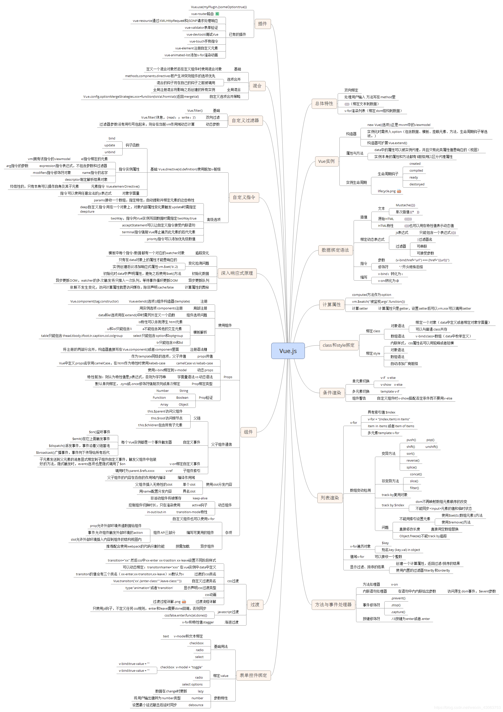

# VUE知识要点总结思维导图

1、MVVM思想

2、vue常见指令

3、Vue生命周期的介绍

4、组件间通信

5、路由的使用 vue-router

6、vue发送 ajax请求

7、计算属性,方法与侦听器

8、组件间绑定原生事件

9、vue常见插件

10、全局事件的绑定与解绑

11、vue递归组件实现

12、vue动画特效

13、vue移动端开发注意点

14、flex布局

15、vue的事件及事件修饰符

16、vue性能优化

